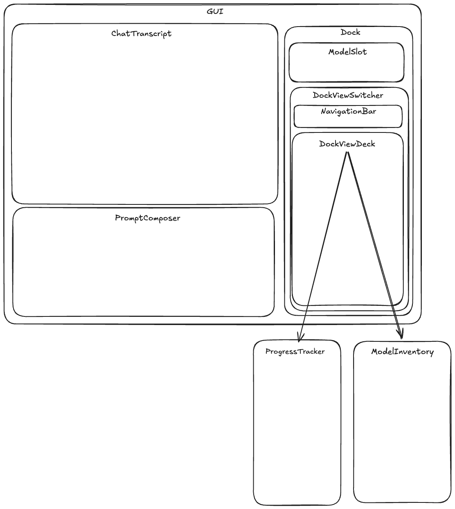

# Dumbey

Repo born from the ["Build Your own Claude Code"](https://codecrafters.io/challenges/claude-code) CodeCrafters challenge, Dumbey is a Java harness for LLM models... a not-so-bright one.

Eventually, after getting to the end of the challenge and having the agent do some basic things over CLI commands, I decided (for some god knows why reason) to add a Swing UI interface to it (maybe I felt nostalgic for having worked with it back in 2015-2017).

## Quick Start

### Dependencies

- [Make](https://www.gnu.org/software/make/)
- [Java SDK (v25)](https://sdkman.io/)

### Running Locally

1. Create a copy of `.env.example` and call it `.env`

2. Start LM Studio under `http://localhost:1234/v1` and load the `gemma-4-e2b` model

3. Run `make run`

4. Play around with.. an LLM agent of sorts!

## UI Layout

The following is a diagram detailing the composition of views / components in the app's UI (`gui` package). It helps to get acquainted with it before diving into the code:

_Ps.: the file `docs/ui-layout.excalidraw.png` embeds excalidraw metadata, ie, you can open and make updates directly to it._
